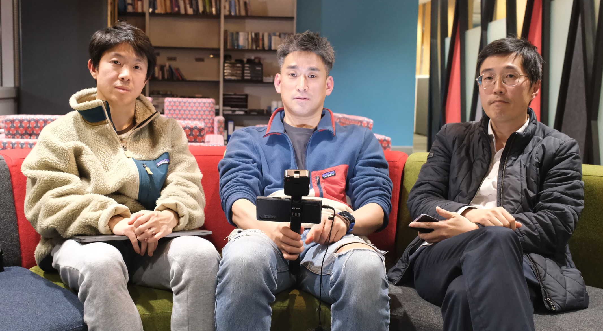
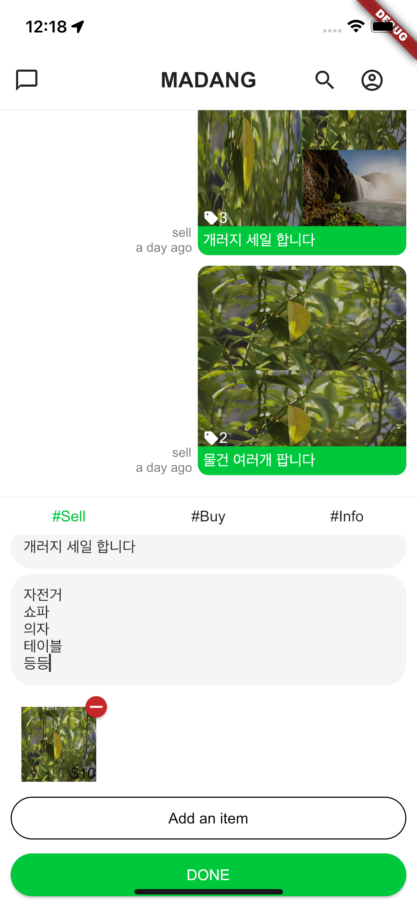
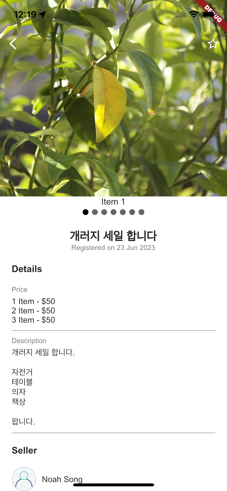

# TAU (TriAllUs)

저희 타우는 뉴질랜드 크라이스트처치에서 한인 3명이 시작한 스타트업입니다.

## About Us

서로 다른 배경을 가진 한국인 3명이 뉴질랜드라는 먼 타국으로 이민을 와서 서로가 가진 경험과 지식으로 새로운 서비스를 개발하여 뉴질랜드를 포함한 타국에서 지내고 있는 한인 교민들의 어려움을 해결하고자 TriAllUs라는 스타트업을 2021년 시작되게 되었습니다.

### Co-Founders

(왼쪽부터) 송창은, 안주현, 전정현

## Products

  

2023년 현재 TAU는 아래와 같은 문제점들을 해결하고자 Madang 이라는 채팅 기반의 커뮤니티 플랫폼을 개발하고 있습니다.

1. 교민들 사이 지나치게 높은 카카오톡 오픈채팅방 의존도 및 문제점

   1.1 익명 유저 입장 허용으로 신뢰성 및 건정성 저하

   1.2 채팅을 위한 앱으로 정보공유 및 물품거래 시 불편함

   1.3 알림 설정의 단편화로 관심있는 메시지만 알림 수신 불가 (관심 상품 혹은 정보)

2. 기존 웹 기반 커뮤니티 사이트(영국사랑(http://www.04uk.com/), 코리안포스트(https://www.nzkoreapost.com/) 등) 실시간 커뮤니케이션 부재

외교부에 따르면 현재 재외동포는 2021년 기준 732만 명으로 추정되고 있으며 앞으로 그 숫자는 더 늘어날 전망입니다. 하지만, 모국인 한국에서도 현재 지내고 있는 타국에서도 이방인으로 취급 받으며 서비스 사각지대에 놓여 있습니다. Madang은 그런 재외동포 분들을 위한 채팅 기반의 커뮤니티 플랫폼으로 필요한 정보를 실시간으로 어느 서비스보다 빠르게 받아 볼 수 있으며 한인간 거래를 보다 편리하게 할 수 있도록 돕는 데 최선을 다하고 있습니다.

더 나아가, 타국에서 비즈니스를 운영하시는 분들에게 한층더 효과적인 광고 및 비즈니스 운영을 돕고자 서비스를 기획 중입니다.
